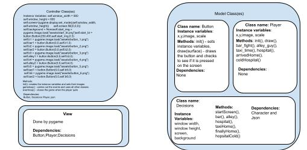

:warning: Everything between << >> needs to be replaced (remove << >> after replacing)
# CS110 Project Proposal
<<<<<<< HEAD
# Final Project
## CS 110 Final Project
### Fall, 2021
=======
# << Final Project >>
## CS 110 Final Project
### << Fall, 2021 >>
>>>>>>> 6e791181b31cc230b81960f8f0ba399d36f07f69
### [Assignment Description](https://docs.google.com/document/d/1H4R6yLL7som1lglyXWZ04RvTp_RvRFCCBn6sqv-82ps/edit#)

<< [https://github.com/<repo>](#) >>

<< [link to demo presentation slides](#) >>

<<<<<<< HEAD
### Team: Coding Connoisseurs
#### Matthew Kagan, Spencer Mines
=======
### Team: << Coding Connoisseurs >>
#### << Matthew Kagan, Spencer Mines >>
>>>>>>> 6e791181b31cc230b81960f8f0ba399d36f07f69

***

## Project Description *(Software Lead)*
 This project is a choose your own adventure game based in New York City where there are clickable GUI buttons and choices that will either progress you in the game or cause you to lose.

***    

## User Interface Design *(Front End Specialist)*
* << A wireframe or drawing of the user interface concept along with a short description of the interface. You should have one for each screen in your program. >>
    * For example, if your program has a start screen, game screen, and game over screen, you should include a wireframe / screenshot / drawing of each one and a short description of the components
* << You should also have a screenshot of each screen for your final GUI >>

***        

## Program Design *(Backend Specialist)*
* Non-Standard libraries
    * Pygame
    * For each additional module you should include
        * https://www.pygame.org/docs/
        * This module is used to create the screen and game
* Class Interface Design
    * << A simple drawing that shows the class relationships in your code (see below for an example). >>
        * 
    * This does not need to be overly detailed, but should show how your code fits into the Model/View/Controller paradigm.
* Classes
    * Contoller class - sets the instance variables for the game and carries out the process of loading all the GUI and image components onto the screen
      Button class - provides a GUI button that we use to change the scenes as the game progresses
      Player class - provides the captioning and player image for each screen as the game goes on with the font
      Decisions class - provides the background and music for each screen as the player picks their choice

## Project Structure *(Software Lead)*

The Project is broken down into the following file structure:
* main.py
* bin
    * <all of your python files should go here>
* assets
    * <all of your media, i.e. images, font files, etc, should go here)
* etc
    * <This is a catch all folder for things that are not part of your project, but you want to keep with your project. Your demo video should go here.>

***

## Tasks and Responsibilities *(Software Lead)*
* You must outline the team member roles and who was responsible for each class/method, both individual and collaborative.

### Software Lead - << name >>

<< Worked as integration specialist by... >>

### Front End Specialist - << name >>

<< Front-end lead conducted significant research on... >>

### Back End Specialist - << name >>

<< The back end specialist... >>

## Testing *(Software Lead)*
* << Describe your testing strategy for your project. >>
    * << Example >>

* Your ATP

| Step                  | Procedure     | Expected Results  | Actual Results |
| ----------------------|:-------------:| -----------------:| -------------- |
|  1  | Open terminal, navigate to folder and type "python3 main.py"  | program starts and siaplsy start screen with start button  | program starts and siaplsy start screen with start button         |
|  2  | Press the start button to intiate the game  | the bar scene loads onto screen with 2 more options for the user to choose between |  the bar scene loads onto screen with 2 more options for the user to choose between               |
|  3  | Choose an option to continue from the bar scene  | Based on the option chosen from the GUI buttons, the game will either continue and load the alley scene or you will end up in the hospital and lose  |  Based on the option chosen from the GUI buttons, the game will either continue and load the alley scene or you will end up in the hospital and lose        |
|  4  | Choose an option to continue from the alley scene  | Based on the option chosen from the GUI buttons, the game will either continue and load the taxi scene or you will end up in the hospital and lose  | Based on the option chosen from the GUI buttons, the game will either continue and load the taxi scene or you will end up in the hospital and lose                 |
|  5  | Choose an option to continue from the taxi scene  | Based on the option chosen from the GUI buttons, the game will either continue and load the victory scene or you will end up in the hospital and lose  | Based on the option chosen from the GUI buttons, the game will either continue and load the victory scene or you will end up in the hospital and lose          |

